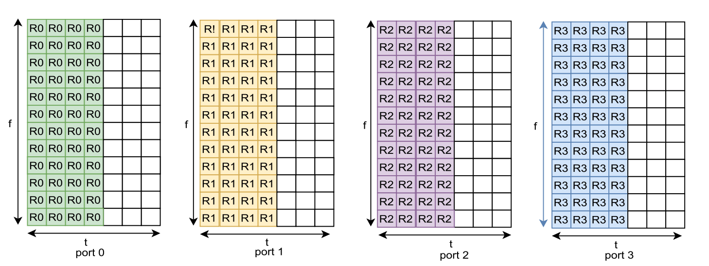

# Learning for Detection: MIMO-OFDM Symbol Detection Through Downlink Pilots
This repository contains the code for the paper "[Learning for Detection: MIMO-OFDM Symbol Detection Through Downlink Pilots](https://ieeexplore.ieee.org/document/9020011)".

## Environment Set Up
This code is tested with python version 3.6 in macOS and Linux operating system.
```buildoutcfg
$ conda create -n wesn python=3.6
$ conda activate wesn
$ pip install scikit-learn matplotlib scipy scikit-commpy sympy
```

## Key Points
This respository consists of the MIMO-OFDM transmission module, power amplifier (PA) module, channel generation, and receive processing.

### MIMO-OFDM Transmission Module
This code supports different configurations of the MIMO-OFDM system such as `1x1`, `2x2`, and `4x4` MIMO system. 
All available options can be configured in the dictionary `MIMO_OFDM_para` of the `main.py`.

The adopted pilot structure is the block pilot pattern shown below.
Specifically, the first four OFDM symbols are set as pilots and the rest is set as the data OFDM symbols.
<p align="center">
    
</p>

### Power Amplifier (PA) Module
The PA module can be enabled by setting `USE_PA` to `True` in the dictionary `MIMO_OFDM_para` of the `main.py`.

### Channel Generation

The code can be readily applied to different channel models. 
More details about channel generation is provided in [channel.md](channels/channel.md).

A sample channel file can be downloaded from [here](https://drive.google.com/file/d/1BmXwnUi5rc5yK1mxGe9q3zIltas7hSVj/view?usp=sharing).
It is the WINNER II channel model generated by MATLAB with urban macrocell NLOS outdoor-to-indoor scenario.
After downloading the channel files, put it in the `channels` folder.

### Receive Processing

The parameters of WESN can be set in the `RC_para_standard` of the `main.py`.
The code can be tested with the following command.
```buildoutcfg
$ python main.py
```

## Citation
If you find this code useful for your research, please consider citing the following paper:

```buildoutcfg
@article{zhou2020learning,
  title={Learning for detection: MIMO-OFDM symbol detection through downlink pilots},
  author={Zhou, Zhou and Liu, Lingjia and Chang, Hao-Hsuan},
  journal={IEEE Transactions on Wireless Communications},
  volume={19},
  number={6},
  pages={3712--3726},
  year={2020},
  publisher={IEEE}
}
```